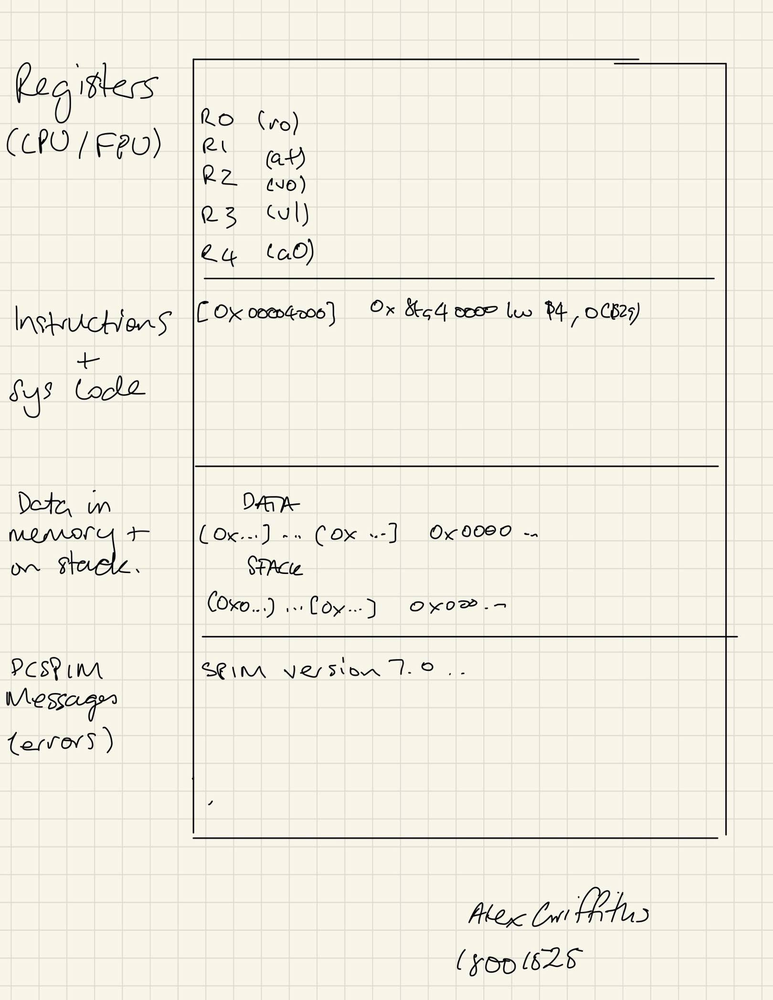

# Lab 01 - Workshop Tasks
```
Alex Griffiths - 18001525
2020
```

## Preparation

### Question 2


__2a__)

__Row One__: Shows the available registers. There are registers for 32 bit integers, and registers for 32bit floating point numbers (In the FPU)

__Row Two__: Shows the instructions from a loaded program as well as the assembled instructions and machine code.

__Row Three__: Shows the data currently in memory as well as data on the stack.

__Row Four__: This section shows an error messages from PCSpim.

## Workshop Tasks

### Question 3

Run helloimproved.s and identify original text of instruction, assembled text, machine code.
```
[0x00400024]	0x001fb821     addu $23, $0, $31               ; 7: addu $s7, $0, $ra      # save the return address in a register
                ^^^^^^^^^^     ^^^^^^^^^^^^^^^^^                    ^^^^^^^^^^^^^^^^^
                Machine Code   Assembled Version                    Original Text Instructions
[0x0040002c]	0x3c041001     lui $4, 4097 [label1]           ; 17: la $a0, label1         # takes string address as an argument
                ^^^^^^^^^^     ^^^^^^^^^^^^^^^^^                     ^^^^^^^^^^^^^^
                Machine Code   Assembled Version                     Original Text Instructions
```
Differences:
        Machine Code: This contains the assembled instructions in a format that is readable by the machine. In this case Hexadecimal.

### Question 4

Clearing the registers causes all the values stored in the registers to be set to 0. This option is provided because you don't want your register to already contain data when you load a program, which could cause it to have an undesired output.

### Question 5
By adding the line "sub $s0, $t0" the simulator finds a syntax error because only two registers (or values) were provided to the instruction, when the _sub_ instruction requires three registers. One to store the operation's, and two values to use for the operation.

The effect of not having this last register meant that QtSpim would not continue loading instructions, which would mean the program would not run.

### Question 7
The cursor is placed on the next line because the ascii string that was stored includes the newline character "\n" at the end of it.

The syscall function is used to execute a predefined function based on the value that is loaded into the $v0 register with the li instruction.

Arguments for syscall are loaded with the la instruction. Arguments for different services need to be loaded into predefined registers. There is a table of these registers in the Appendix.

In this case, the print_string syscall code is loaded into $v0, and the argument for it is loaded into $a0 as is defined in the Appendix table. We use la here because label1 is an address that points to a string, and we want the string itself, not the address.
