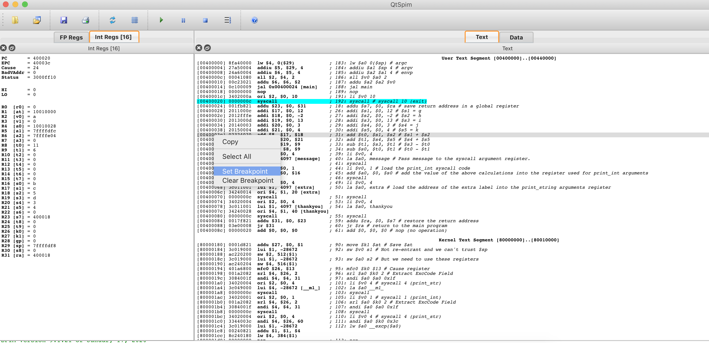
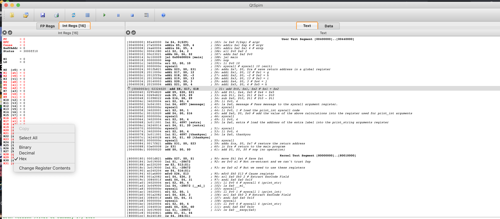
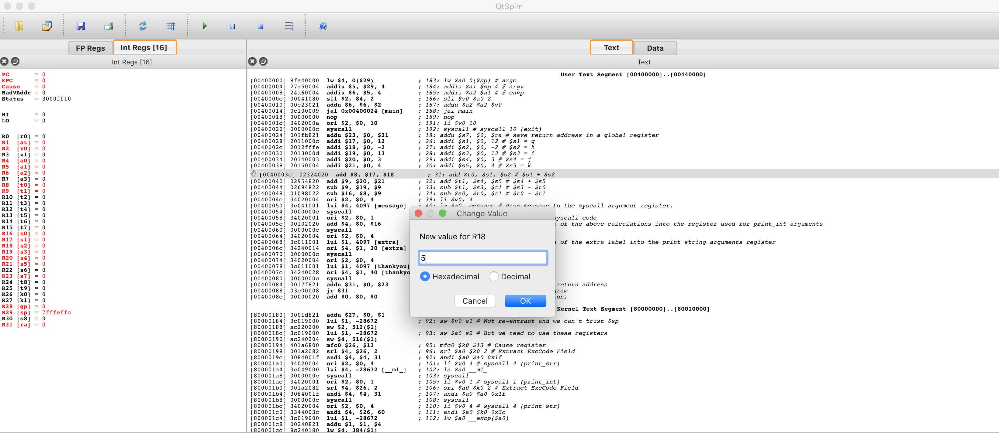
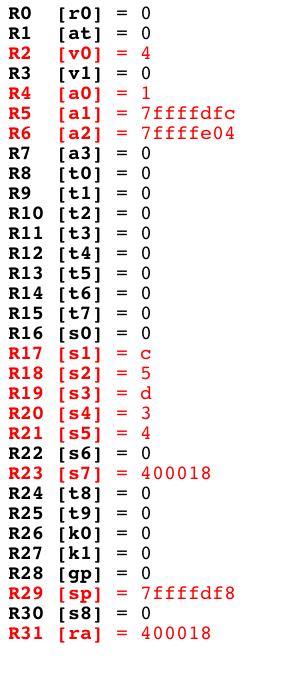
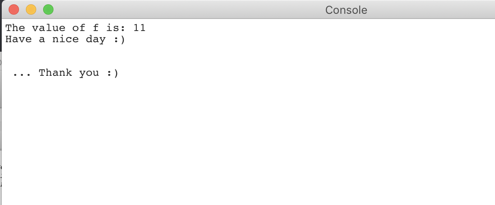
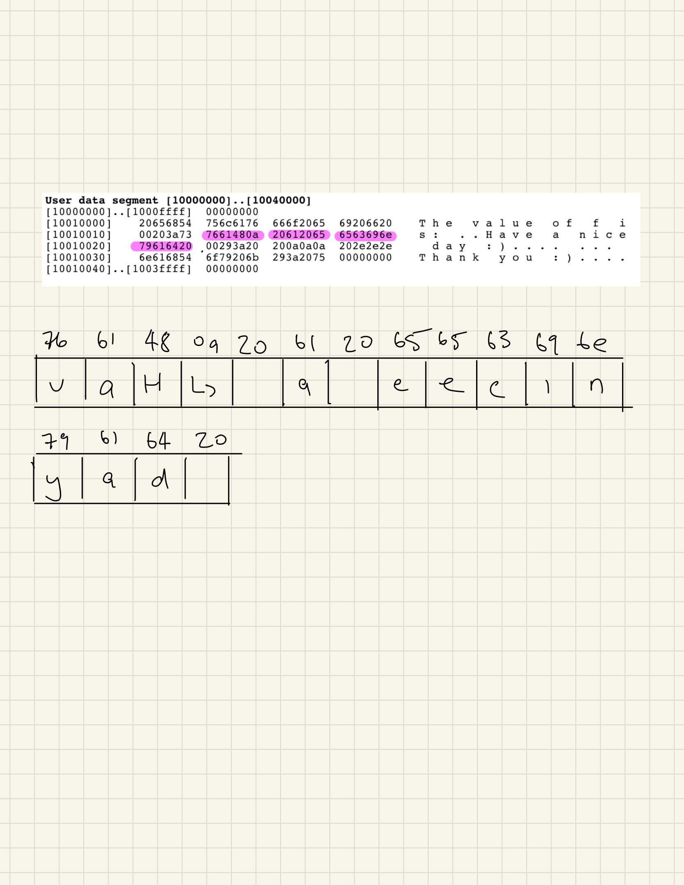
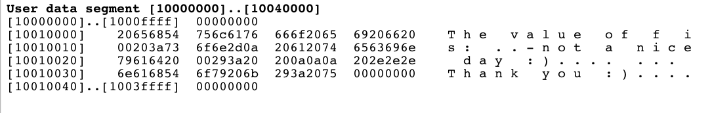
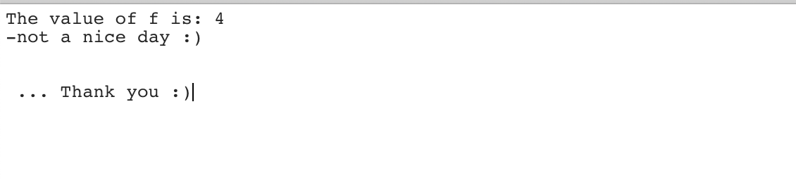
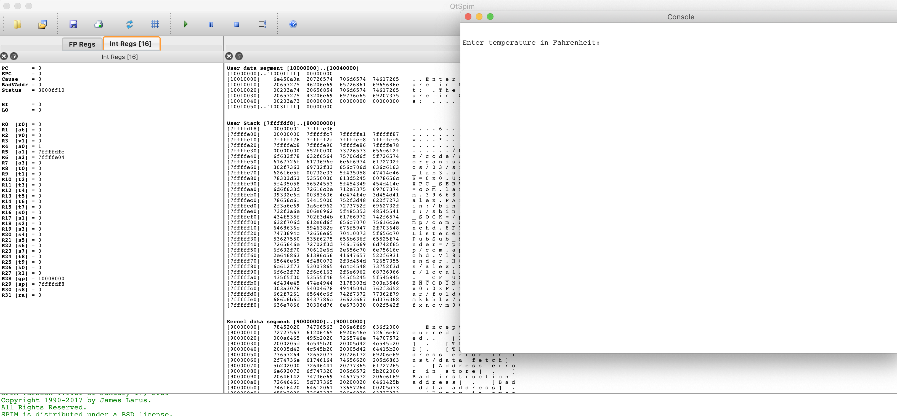
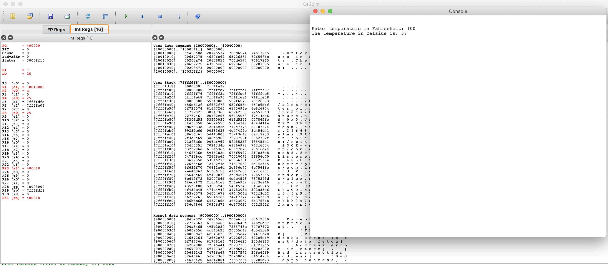

# Lab 3

## Preparation

```
Alex Griffiths
18001525
```

### Question 2
__a__

The first instruction of a user's code is stored in 0x00400024. You can recognize the user's first instruction as it starts after the `main:` label. This label must be a global label.

__b__

```
       "H"             "a"               "v"
HEX    48              61                76
BINARY 0100 1000       0110 0001         0111 0110
```

## Workshop Tasks

### Question 2
After altering `simplecalc.s` to include the formula `x = (g + h) - (i - j + k)`, the expected result of the formula should be 4. I have set the values of each value as follows:
```
g = 12
h = -2
i = 13
j = 3
k = 4
```

This resolves to:

```
x = (12 + (-2)) - (13 - 3 + 4)
  = 10 - (13 - 7)
  = 10 - 6
  = 4
```

_Breakpoint after initial values are set_

You can see the line selected comes after the intial values are set (Please ignore the light blue line. I do not know why it is highlighted, but the breakpoint is not inserted on this line)



_Choosing & setting a new value in the register_

Here I'm selecting the `$s2` register to alter by clicking `Change Register Contents`

You can also see a hand icon next to the line where the breakpoint is inserted.



Here I am assigning a new value (`5`) to the register. I have the `Hexadecimal` radio button selected, which for this value is fine because 5 in Decimal is represented the same way as in Hexadecimal.


<div style="page-break-after: always;"></div>

_Altered Registers_

You can see in register 18 (the register for `$s2`) that the value 5 is set.



<div style="page-break-after: always;"></div>

_The result after changing the value in the register_



The above image shows the output of the program, and specifically, the first line contains the calculated value of the new formula, which written out would look like:

```
x = (12 + 5) - (13 - 3 + 4)
  = 17 - (13 - 7)
  = 17 - 6
  = 11
```

<div style="page-break-after: always;"></div>

### Question 3

_Memory Segments holding the message "Have a nice day". The highlighted sections are the words containing the hex codes of the string._

The way this data is loaded in to memory address looks like this:
```
 ADDRESS     HEX
|1001002F|y |79
|1001002E|a |61
|1001002D|d |64
|1001002C|  |20
|1001002B|e |65
|1001002A|c |63
|10010029|i |69
|10010028|n |6E
|10010027|  |20
|10010026|a |61
|10010025|  |20
|10010024|e |65
|10010023|v |76
|10010022|a |61
|10010021|H |48
|10010020|LF|0A
|  ...   |  |
|10010000|  |
 ^^^^^^^^
 Base Addr
```



It might not be clear in the image above, but each word is 4 characters long, as each character is a byte, and a word is 32 bits long. As a byte is 4 characters, we can only have 4 characters per word.

Each word is packed with the hex code for first character in the least significant bit. When the word is full, the next hex code for the ASCII character is stored in the least significant bit of the next word. This leads to a strange memory layout which when blocked out looks like the values in the table I have drawn.

_After altering the data segment that is loaded by QtSpim_


_Output to console after altering the data segment_

### Question 4

We load data from the user input by loading the syscall code `5` into `$v0`. Calling the `syscall` instruction will then wait for the user's input. When it receives the user's input, it will store the value in `$v0`, which we then move to `$t0` to maintain appropriate use of registers following convention.

The formula that was used to convert temperature from Farenheit to Celsius is

```
C = (5 * (x - 32)) / 9

x = user input
```

_Screenshots of the program running_




